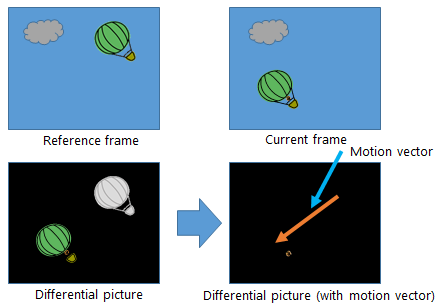
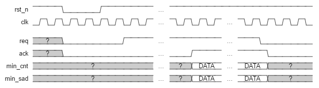
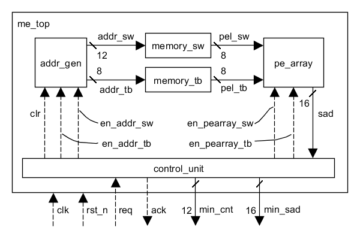

# Motion Estimation Processor

Hardware implementation of [Motion Estimation](https://en.wikipedia.org/wiki/Motion_estimation) algorithm written in Verilog-HDL.
It's currently under development.

## About Motion Estimation

Motion Estimation is a process of finding motion vectors from a reference frame to the current frame.
We apply the following process for each of the macro blocks in the current frame.
We first find a block which has the lowest matching error in the search window of the reference frame.
We use sum of absolute errors between corresponding pixels.
Then, the displacement between the current macro block to the best matching macro block is motion vector.


## Description

- Fullsearch based motion estimation
- Only integer pixel motion estimation
- Template Block: 16x16 pixels
- Search Range  : ±24 pixels
- It's currentry running on MU500-RX FPGA board \& MU500-7SEG 7seg LED board

## Required Tools

- [Icarus Verilog(>=10.0)](http://iverilog.wikia.com/wiki/Installation_Guide)
- [Altera Quartus Prime(>=15.0)](https://www.altera.co.jp/downloads/download-center.html)
- Excel 2013
- [Python 2.7](https://www.python.org/downloads/)

## How to run Simulation

1. Open `memory/memory.xlsx`
1. Click 'Create Memory' button to create `memory/memory_sw.txt` for search range memory and `memory_tb.txt` for template block memory
1. Run `make_tb.sh`
1. You will find the wave file `testbench/***.vcd`

## How to synthesis Motion Estimation Processor

1. Open `memory/memory.xlsx`
1. Click 'Create Memory' button to create `memory/memory_sw.txt` for search range memory and `memory_tb.txt` for template block memory
1. Run `make_mif.sh` to generate mif files
1. Open `fpga/fpga_top.qpf` in Altera Quartus Prime
1. Compile it

## Source Code Organization

The Motion Estimation Processor source code is organized as follows:

```text
docs/       documentation
fpga/       fpga related files
memory/     memory dependencies
rtl/        RTL files for Motion Estimation Processor
testbench/  test suites
tools/      tool for creating mif file
```

## Timing chart



## Block diagram



## Parameters

### TB\_LENGTH

Size of the template block.
The default value is `16` pixel.

### SW\_LENGTH

Size of the search window.
The default value is `64` pixel.

### PE\_OUT\_WIDTH

Bit width of the Processor Element's output.
The default value is `8` bit.

### MEMORY_SW_CONTENT

Path to the search window memory file which contains pixel values.
If you run on iverilog, you should specify text file. If you compile it with Quartus, you should specify mif file.
The default value is `"../memory/memory_sw.txt"`.

### MEMORY_TB_CONTENT

Path to the template block memory file which contains pixel values.
If you run on iverilog, you should specify text file. If you compile it with Quartus, you should specify mif file.
The default value is `"../memory/memory_tb.txt"`.

## Testbench template

```verilog
`include "some_module.v"
`default_nettype none

module tb_some_module;

reg rst_n;
reg clk;

some_module
_some_module
  (
  .rst_n ( rst_n ),
  .clk   ( clk   )
);

parameter CLK_PERIOD = 10.0;
always #(CLK_PERIOD/2) clk <= ~clk;

initial begin
  $dumpfile("tb_some_module.vcd");
  $dumpvars(0, tb_some_module);
end

initial begin
  #1 rst_n<=1'bx;clk<=1'bx;
  #(CLK_PERIOD)   rst_n<=1;
  #(CLK_PERIOD*3) rst_n<=0;clk<=0;
  repeat(5) @(posedge clk);
  rst_n<=1;
  @(posedge clk);
  repeat(2) @(posedge clk);
  $finish(2);
end

endmodule
`default_nettype wire
```
